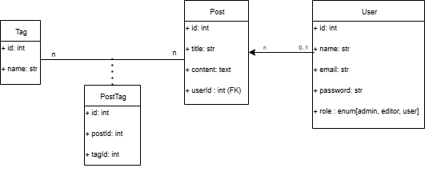

# express-ts-antistress

[](https://www.npmjs.com/package/generator-express-ts-antistress)
[](https://opensource.org/licenses/MIT)

Sebuah generator CLI untuk menghilangkan stres saat memulai proyek REST API baru. Hasilkan boilerplate lengkap dengan TypeScript dan Express.js dari satu file skema JSON.

---

## Daftar Isi
- [Fitur Utama](#fitur-utama)
- [Prasyarat](#prasyarat)
- [Instalasi](#instalasi)
- [Cara Penggunaan](#cara-penggunaan)
- [Struktur Skema JSON](#struktur-skema-json)
  - [Struktur Model](#struktur-model)
  - [Properti Field](#properti-field)
  - [Properti Relation](#properti-relation)
  - [Contoh Lengkap](#contoh-lengkap)
- [Struktur Proyek yang Dihasilkan](#struktur-proyek-yang-dihasilkan)
- [Penggunaan API](#penggunaan-api)
- [Lisensi](#lisensi)

---

## Fitur Utama
- 🚀 **Cepat & Produktif:** Hemat waktu setup proyek dan langsung fokus pada logika bisnis.
- 🏗️ **Multi-Arsitektur:** Pilih antara arsitektur MVC atau Layered yang bersih dan terstruktur.
- ✍️ **Generasi CRUD Otomatis:** Endpoint CRUD lengkap dengan validasi dasar dibuat secara otomatis dari skema Anda.
- ✅ **Siap Uji:** Kerangka Unit Test dengan Jest ikut dihasilkan untuk setiap endpoint.
- 📦 **TypeScript Ready:** Proyek modern dengan type-safety penuh untuk pengembangan yang lebih aman.
- 🚀 **Dukungan ORM/ODM** : Dukungan untuk menggunakan Sequelize sebagai ORM atau Mongoose sebagai ODM.

---

## Prasyarat
Pastikan perangkat Anda telah terinstal:
1. [Node.js](https://nodejs.org/) (versi 22.x atau lebih tinggi)
2. [Yeoman](https://yeoman.io/): `npm install -g yo`

*Jika belum terinstall, maka wajib untuk menginstall keduanya

---

## Instalasi Generator (Lokal)
```bash
npm install generator-express-ts-antistress
````
---
## Instalasi Generator (Global)
```bash
npm install -g generator-express-ts-antistress
````

-----

## Cara Penggunaan

1. Buat direktori baru untuk proyek Anda.
2. Buat sebuah file skema, misalnya `schema.json`, yang mendefinisikan model data Anda.
3. Buka terminal di direktori pilihan Anda, lalu jalankan generator dengan perintah:

    ```bash
    yo express-ts-antistress
    ```
4.  Jawab pertanyaan yang muncul di terminal:
      - **Nama proyek?** (contoh: `my-awesome-api`)
      - **Pilih arsitektur (MVC/Layered)?**
      - **Pilih database?** (MySQL/PostgreSQL/MongoDB/SQLite)
      - **Masukkan path file skema JSON:** (contoh: `schema.json`)
          - Jika file schema.json berada di direktori utama proyek (root), cukup masukkan: schema.json.
          - Jika berada dalam subfolder, masukkan path relatifnya, misalnya: configs/schema.json.

    Generator akan membuat direktori proyek baru dan menghasilkan semua file yang diperlukan.
5. Untuk menjalankan projek output, jangan lupa untuk pindah ke direktori projek output. Misal projek output bernama `my-awesome-api`, maka jalankan perintah:
    ```bash
      cd my-awesome-api
    ```
  
    setelah itu jalankan perintah:
    ```bash
      npm run dev
    ```


-----


## Struktur Skema JSON

Skema JSON adalah jantung dari generator ini. Ini adalah file di mana Anda mendefinisikan semua model, field, dan relasi untuk aplikasi Anda.

### Struktur Model

File skema harus memiliki properti root `models` yang berisi sebuah array dari objek model. Setiap objek model harus menggunakan **PascalCase** untuk namanya dan memiliki properti berikut:

| Properti | Tipe | Wajib? | Deskripsi |
| :--- | :--- | :---: | :--- |
| `name` | `string` | Ya | Nama model (e.g., "User", "ProductCategory"). |
| `fields` | `object` | Ya | Objek yang berisi definisi semua field untuk model ini. |
| `relations`| `object` | Tidak | Objek yang berisi definisi relasi ke model lain. |

Contoh Penulisan:

```json
{

  "models":[
    {
      "name" : "NamaModel", // wajib
      "fields" : { // wajib
        "field1" : {"type": "tipe-data"} 
      },
      "relations" : { // opsional, jika memiliki relasi
        "relations1": {"model": "NamaModelLain", "type": "tipe-relasi"}
      }

    }
  ]
}


```
### Properti Field

Properti `fields` berisi key-value pair, di mana *key* adalah nama field dan *value* adalah objek konfigurasinya.

| Properti | Tipe | Deskripsi |
| :--- | :--- | :--- |
| `type` | `string` | **Wajib.** Berisi tipe data untuk field. Lihat daftar tipe yang didukung di bawah. |
| `primaryKey`| `boolean`| Menandakan sebagai primary key. (true / false) |
| `autoIncrement`|`boolean`| Mengaktifkan auto-increment (true / false). |
| `required` | `boolean`| Untuk field ini tidak boleh kosong. (true / false) |
| `unique` | `boolean`| Nilai field ini harus unik di dalam tabel. (true / false)|
| `default` | `any` | Nilai default jika tidak ada nilai yang diberikan. |
| `enum` | `array` | Daftar nilai yang diizinkan untuk field bertipe string/enum. |
| `foreignKey`| `boolean`| Menandakan field ini sebagai foreign key. **Wajib ada** pada field yang menjadi dasar relasi `belongsTo` (format: `ModelNameId`, contoh: userId). |
| `references`| `string` | Nama model dan field yang direferensikan (format: `"Model.Id"`, misal User.Id). |
| `onDelete` | `string` | Aksi saat data di tabel referensi dihapus (e.g., "CASCADE", "SET NULL"). |
| `onUpdate` | `string` | Aksi saat data di tabel referensi di-update (e.g., "CASCADE"). |

**Tipe Data yang bisa digunakan untuk `type`:**
`string`, `text`, `integer`, `float`, `double`, `decimal`, `bigint`, `boolean`, `date`, `datetime`, `timestamp`, `time`, `uuid`, `varchar`, `char`, `smallint`, `mediumint`, `tinyint`, `json`, `object`, `array`, `blob`, `binary`, `enum`, `objectId`.

Contoh:

```json
{

  "models":[
    {
      "name" : "User", // wajib
      "fields" : { // wajib
        "id" : {"type": "integer", }, // "type" wajib ada, misal {"type": "integer"}
        "email" : {"type": "string", "unique": true}, // unique dan lainnya opsional
        "password" : {"type": "string", "required": true},
      },
      "relations" : { // opsional, jika memiliki relasi.
        "posts": {"model": "Post", "type": "hasMany"} 
      }

    },
    {
      "name" : "Post", // wajib
      "fields" : { // wajib
        "id" : {"type": "integer", },
        "title" : {"type": "string", "required": true, "unique": true},
        "content" : {"type": "text"},
        "userId" : { // contoh penulisan foreignKey
          "type": "integer",
          "foreignKey": true,
          "references": "User.id",
          "onDelete": "CASCADE"
        },
      },
    }
  ]
}
```


### Properti Relation

Properti `relations` mendefinisikan hubungan antar model.

| Properti | Tipe | Deskripsi |
| :--- | :--- | :--- |
| `type` | `string` | **Wajib.** Tipe relasi: `hasMany`, `hasOne`, `belongsTo`, `manyToMany`. |
| `model`| `string` | **Wajib.** Nama model target yang berelasi (harus PascalCase). |
| `through`| `string` | **Wajib untuk `manyToMany`**. Nama model junction/pivot table. |
| `cascadeDelete`|`boolean`| Jika `true`, menghapus data induk akan menghapus data anak yang berelasi. |

### Jenis-Jenis Relasi
Berikut adalah penjelasan untuk setiap type relasi yang dapat Anda gunakan:

1. hasOne (Satu ke Satu)
Menjelaskan bahwa satu baris data di model ini terhubung dengan tepat satu baris data di model lain.
    - Struktur Kunci: Foreign key biasanya berada di model target (tabel profiles memiliki userId).
    - Contoh: Satu User memiliki satu Profile.

    ```json
    {
      "name": "User",
      "fields": {
       ...
      },
      "relations": {
        "profile": { "type": "hasOne", "model": "Profile", "cascadeDelete": true }
      }
    }
    ```

2. hasMany (Satu ke Banyak)
Menjelaskan bahwa satu baris data di model ini terhubung dengan banyak baris data di model lain.
    
    - Struktur Kunci: Foreign key berada di model target (tabel posts memiliki userId).
    - Contoh: Satu User memiliki banyak Post.
    
    ```json
    {
      "name": "User",
      "fields": {
       ...
      },
      "relations": {
        "posts": {"type": "hasMany", "model": "Post", "cascadeDelete": true}, //cascadeDelete opsional
      }
    },
    ```

3. belongsTo (Dimiliki Oleh)
Ini adalah kebalikan dari relasi hasOne atau hasMany. Relasi ini menyatakan bahwa model ini "milik" satu baris data di model lain.
    - Struktur Kunci: Foreign key berada di model ini (tabel posts harus memiliki field userId).
    - Contoh: Satu Comment dimiliki oleh (belongsTo) satu User.
    
    ```json
    {
      "name" : "Comment",
      "fields": {
        ....
        "userId": {                   // wajib ada foreignKey di model ini
          "type": "integer",
          "foreignKey": true,         // wajib true
          "references": "User.id",    // wajib ada. Penulisan harus dengan format : `Model.id`
          "onDelete": "SET NULL"
        }
      },
      "relations": {
        "user": { "type": "belongsTo", "model": "User" }
      }
    }
    ```


4. manyToMany (Banyak ke Banyak)
Hubungan kompleks di mana banyak baris data di model ini bisa terhubung dengan banyak baris data di model lain.
    - Struktur Kunci: Relasi ini wajib menggunakan tabel perantara (junction/pivot table) untuk menyimpan pasangannya. Nama model tabel perantara ini didefinisikan di properti through.
    - Contoh: Satu Post bisa memiliki banyak Tag, dan satu Tag bisa digunakan di banyak Post. Maka untuk menghubungkan Post dan Tag, kita perlu membuat model perantara (postTags)
    
    ```json
    {
      "name": "Post",
      "fields": {
        ....
      },
      "relations": {
        "tags": { "type": "manyToMany", "model": "Tag", "through": "PostTags" }
      }
    }
    ```


### Contoh Lengkap

  

Contoh schema.json

```json
{
  "models": [
    {
      "name": "User",
      "fields": {
        "id": { "type": "integer", "primaryKey": true, "autoIncrement": true },
        "name": { "type": "string", "required": true },
        "email": { "type": "string", "required": true, "unique": true },
        "password": { "type": "string", "required": true },
        "role": { "type": "string", "enum": ["admin", "editor", "user"], "default": "user" }
      },
      "relations": {
        "posts": { "type": "hasMany", "model": "Post" }
      }
    },
    {
      "name": "Post",
      "fields": {
        "id": { "type": "integer", "primaryKey": true, "autoIncrement": true },
        "title": { "type": "string", "required": true },
        "content": { "type": "text" },
        "userId": {
          "type": "integer",
          "foreignKey": true,
          "references": "User.id",
          "onDelete": "CASCADE"
        }
      },
      "relations": {
        "user": { "type": "belongsTo", "model": "User" },
        "tags": { "type": "manyToMany", "model": "Tag", "through": "PostTag" }
      }
    },
    {
      "name": "Tag",
      "fields": {
        "id": { "type": "integer", "primaryKey": true, "autoIncrement": true },
        "name": { "type": "string", "required": true, "unique": true }
      },
      "relations": {
        "posts": { "type": "manyToMany", "model": "Post", "through": "PostTag" }
      }
    },
    {
      "name": "PostTag",
      "fields": {
        "id": { "type": "integer", "primaryKey": true, "autoIncrement": true },
        "postId": { "type": "integer", "foreignKey": true, "references": "Post.id" },
        "tagId": { "type": "integer", "foreignKey": true, "references": "Tag.id" }
      },
      "relations": {
        "post": { "type": "belongsTo", "model": "Post" },
        "tag": { "type": "belongsTo", "model": "Tag" }
      }
    }
  ]
}
```

-----

## Struktur Proyek yang Dihasilkan

Struktur folder yang dihasilkan akan terlihat seperti ini.

1. contoh untuk arsitektur **MVC**:
```
my-app/
├── node_modules/         # Direktori dependensi 
├── src/                  # Kode sumber utama aplikasi
│   ├── config/           # Konfigurasi aplikasi (database, environment, dsb)
│   ├── controllers/      # Logic controller untuk menangani request dan response
│   ├── middlewares/      # Middleware untuk validasi
│   ├── models/           # Definisi model dan skema database (ORM/ODM)
│   ├── routes/           # Routing endpoint aplikasi
│   ├── utils/            # Fungsi utilitas dan helper umum
│   └── views/            # Masih belum diimplementasikan
├── test/                 # Kode pengujian aplikasi
│   ├── controllers/      # Test unit/integrasi untuk controller
│   └── helpers/          # Fungsi pendukung untuk testing (setup, mock, dll)
├── .eslintrc.js          # Konfigurasi ESLint untuk menjaga konsistensi kode
├── .prettierrc           # Konfigurasi Prettier untuk format otomatis kode
├── jest.config.js        # Konfigurasi untuk framework testing Jest
├── nodemon.json          # Konfigurasi untuk tool hot-reload Nodemon
├── package.json          # Informasi proyek dan daftar dependensi
├── package-lock.json     # Lockfile untuk menjaga konsistensi versi dependensi
└── tsconfig.json         # Konfigurasi TypeScript

```

2. contoh untuk arsitektur **Layered**:
```
my-app2/
├── node_modules/           # Direktori dependensi dari npm
├── src/                    # Kode sumber utama aplikasi
│   ├── config/             # Konfigurasi aplikasi (database, environment, dll)
│   ├── controllers/        # Menangani request dan response HTTP
│   ├── middlewares/        # Middleware untuk validasi
│   ├── models/             # Definisi skema data / ORM (Sequelize/Mongoose)
│   ├── repositories/       # Akses data ke database (lapisan repository)
│   ├── routes/             # Definisi rute endpoint aplikasi
│   ├── services/           # Business logic, memproses data antara controller dan repository
│   ├── utils/              # Fungsi utilitas dan helper
│   ├── views/              # Masih belum diimplementasikan
│   ├── app.ts              # Inisialisasi aplikasi Express, middleware, dll
│   └── server.ts           # Entry point server (menjalankan aplikasi di port tertentu)
├── test/                   # Kode pengujian aplikasi
│   ├── controllers/        # Pengujian unit/integrasi untuk controller
│   └── helpers/            # Utilitas dan konfigurasi testing (setup database, mock data)
├── .env                    # File environment variable
├── .eslintrc.js            # Konfigurasi ESLint untuk linting kode
├── .prettierrc             # Konfigurasi Prettier untuk format kode otomatis
├── jest.config.js          # Konfigurasi testing dengan Jest
├── nodemon.json            # Konfigurasi Nodemon untuk hot reload saat development
├── package.json            # Metadata proyek dan daftar dependensi npm
├── package-lock.json       # Lock file dependensi npm untuk konsistensi versi
└── tsconfig.json           # Konfigurasi TypeScript


```

-----

## Penggunaan API
 
Proyek yang dibuat berisi kode operasi CRUD lengkap dengan operasi di database. Selain itu, juga dibuatkan file test untuk menguji setiap endpoint Model. Setelah proyek dibuat, berikut langkah-langkah yang perlu dilakukan.

1. **Masuk ke direktori proyek:**
    Masuk ke direktori proyek dengan mengetikkan cd nama-projek di terminal. Misal:
    
    ```bash
    cd myapp
    ```
2. **Jalankan Local Server:**
    Jalankan server lokal dengan menjalankan XAMPP, Laragon, atau yang lainnya. 

3. **Buat Database:**
    Jika proyek menggunakan database sql (MySQL, SQLite, PostgreSQL), maka wajib membuat database dengan nama yang sesuai DB_NAME di file .env. DB_NAME pada file tersebut bisa dirubah sesuai keinginan.

4. **Menjalankan server pengembangan (dengan auto-reload dengn nodemon):**
    Setelah setup database berhasil, API siap dijalankan dengan perintah:

    ```bash
    npm run dev
    ```

  Selain itu terdapat perintah lain yang dapat dijalankan:

  a. **Menjalankan server produksi:**
```bash
npm start
```
  
  b **Menjalankan pengujian:**
```bash
npm test
```
  
  c. **Compile Projek ke JS**
```bash
npm run build
```
  
  d. **Menjalankan format ESLint**
```bash
npm run lint
```
  
  e. **Menjalankan format Prettier**
```bash
npm run prettier
```
  
  f. **Menjalankan format ESLint dan Prettoer bersaman**
```bash
npm run format
```

-----